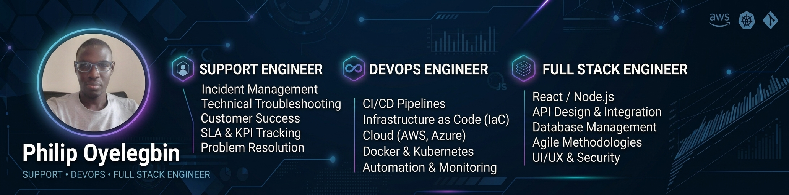

    

        
        
        
        
        
        
        <!--  -->
        
    

    
Hi there 👋🏾! I am a Support Engineer, DevOps, and Full Stack Engineer highly skilled and versatile professional with expertise in application development, and deployment of applications/infrastructure to the cloud. Currently working as a Level 2 Web Hosting Support Engineer, utilizing technical knowledge to provide top-notch support and resolve complex hosting and infrastructure issues.

    
Here is a professional summary highlighting the personality traits:

    <ul align="left">
        <li>Goal-oriented problem solver with a visionary approach.</li>
        <li>Collaborative leader, driven by innovation and excellence.</li>
        <li>Passionate about strategic solutions, team synergy, and achieving exceptional results.</li>
    </ul>
    <!-- 

        
    

    

        
    
 -->

---

# 💫 About Me:

🔭 I'm currently working on some DevOps projects 👯 I'm looking to collaborate on any AI project 🤝 I'm looking to help with any Web development or DevOps project 🌱 I'm currently learning PHP (Laravel) 💬 Ask me about NodeJs, Cloud/DevOps, or any Hosting issues ⚡ Fun fact: I love coding and watching action movies

<!-- ## 🌐 Socials:

      -->

## 💻 Tech Stack:

---

<h2>Highlights</h2>

    
Web Projects

    
Here are some of my other web application projects you might want to check out that are not pinned:

    <ul>
        <li>
            <a href=https://github.com/PhilipOyelegbin/stocksync target="_blank" rel="noopener noreferrer">PhilipOyelegbin/stocksync</a> (<b>41</b> ✨ and <b>21</b> 🍴): 🌻 Retailers and warehouses struggle with stockouts and overstocking due to poor visibility into inventory across multiple locations. They need a system that provides real-time inventory tracking.
        </li>
        <li>
            <a href=https://github.com/PhilipOyelegbin/PhilipOyelegbin target="_blank" rel="noopener noreferrer">PhilipOyelegbin/PhilipOyelegbin</a> (<b>18</b> ✨ and <b>23</b> 🍴): My automated GitHub README Profile built using Nodejs, TypeScript, and GitHub Actions.
        </li>
        <li>
            <a href=https://github.com/PhilipOyelegbin/kinetic-core target="_blank" rel="noopener noreferrer">PhilipOyelegbin/kinetic-core</a> (<b>4</b> ✨ and <b>0</b> 🍴): Kinetic Core is a workout tracker API where users can sign up, log in, create workout plans, and track their progress.
        </li>
        <li>
            <a href=https://github.com/PhilipOyelegbin/waddleapp-api target="_blank" rel="noopener noreferrer">PhilipOyelegbin/waddleapp-api</a> (<b>4</b> ✨ and <b>1</b> 🍴): This application provides a multi-role system with distinct functionalities for administrators, guardians, and orgarnisers for events.
        </li>
        <li>More coming soon 😇.</li>
    </ul>

    
Cloud Projects

    
Here are some of my other cloud projects you might want to check out that are not pinned:

    <ul>
        <li>
            <a href=https://github.com/PhilipOyelegbin/multihost-orchestrator target="_blank" rel="noopener noreferrer">PhilipOyelegbin/multihost-orchestrator</a> (<b>10</b> ✨ and <b>2</b> 🍴): Set up a cPanel-like web hosting server that enables multiple users to host and manage different websites independently, using configuration management tools like Ansible and orchestration tools like Terraform.
        </li>
        <li>
            <a href=https://github.com/PhilipOyelegbin/iac-factory target="_blank" rel="noopener noreferrer">PhilipOyelegbin/iac-factory</a> (<b>10</b> ✨ and <b>2</b> 🍴): A production grade Infrastructure as Code (IaC) solution that enables self service provisioning of isolated 3-tier application environments on AWS.
        </li>
        <li>
            <a href=https://github.com/PhilipOyelegbin/automated-flaskapp-deployment target="_blank" rel="noopener noreferrer">PhilipOyelegbin/automated-flaskapp-deployment</a> (<b>10</b> ✨ and <b>5</b> 🍴): This project illustrates the automation of essential processes: building, testing, and deploying code. It demonstrates my understanding of both the "what" and "why" of CI/CD, not just the "how."
        </li>
        <li>
            <a href=https://github.com/PhilipOyelegbin/cloud-native-guestbook target="_blank" rel="noopener noreferrer">PhilipOyelegbin/cloud-native-guestbook</a> (<b>2</b> ✨ and <b>1</b> 🍴): This is a Multi-Tier Web Application Deployment. It involves deploying a frontend web application that interacts with a backend database, requiring you to manage state, networking, and configuration within a local kubernetes cluster.
        </li>
        <li>More coming soon 😇.</li>
    </ul>

---

## 📊 GitHub Stats:

 
 

### 🏆 GitHub Trophies

### ✍️ Random Dev Quote

### 🔝 Top Contributed Repo

---

<!--  -->
